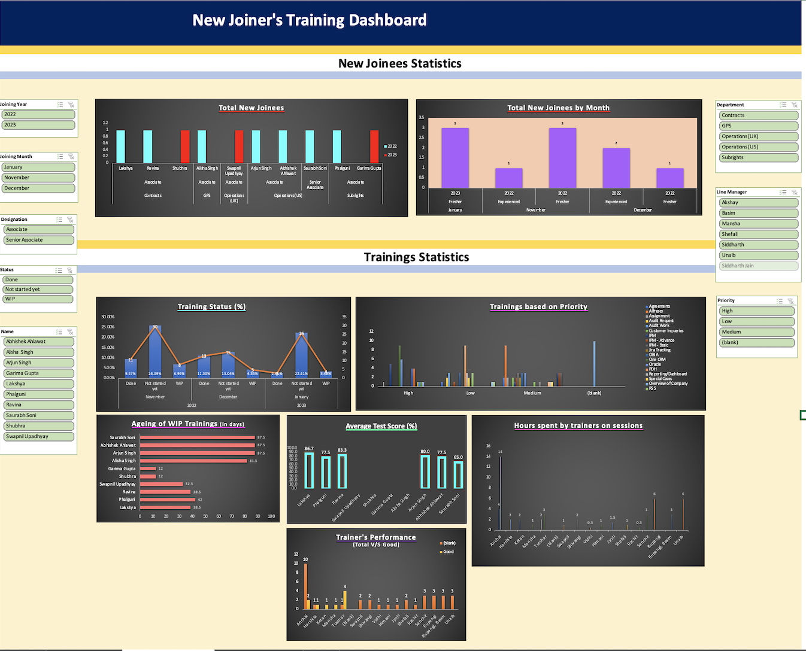

# New Joiner Training Dashboard (MS Excel)

## Executive Summary
- Designed an Excel-based dashboard to provide end-to-end visibility into **new joiner onboarding and training performance**, combining employee statistics with training progress metrics.
- Enabled HR and L&D teams to track **training completion, performance variability, and pending workloads** through monthly status trends, test scores, and priority-based analysis.
- Supported proactive decision-making by highlighting **not-started and long-running trainings** requiring follow-up.

## Project Overview
This project presents an Excel-based dashboard designed to analyze **new joiner onboarding and training performance** within an organization. The dashboard combines new joiner statistics with training-related metrics to provide HR and Learning & Development (L&D) teams with a consolidated view of onboarding progress and training effectiveness.

The focus of this project is on **dashboard design, KPI selection, and analytical insights** derived from training data.

---

## Business Objective
The dashboard is intended to support HR and L&D stakeholders by:
- Monitoring the number and profile of new joiners
- Tracking training completion and progress across months
- Evaluating training performance using test score metrics
- Identifying pending and long-running trainings for follow-up

---

## Tool Used
- Microsoft Excel

---

## Dashboard Structure
The dashboard is divided into two horizontal sections:

### 1. New Joiner Statistics (Top Section)
This section provides an overview of newly onboarded employees and includes filters to analyze data by:
- Department  
- Designation  
- Line Manager  
- Joining Month  
- Joining Year  

Key metrics in this section include:
- Total number of new joiners
- Breakdown of freshers vs experienced hires

---

### 2. Training Statistics (Bottom Section)
This section focuses on training-related performance and progress, supported by the following filters:
- Training Priority
- Training Status

The visuals in this section include:
- Training status distribution across multiple months
- Average test scores of individual trainees
- Ageing of work-in-progress (WIP) trainings in days
- Bar chart showing trainings based on priority level

---

## Dataset Description
The dataset used for this dashboard represents onboarding and training information for new joiners, including:
- Employee details
- Training status (Done, Not Started, Work-in-Progress)
- Training timelines
- Test scores
- Training priority

*(Note: Data used is for demonstration and analytical practice purposes.)*

---

## Dashboard Preview

---

## Key Insights
- The dashboard captures onboarding data for **10 new joiners**, with **freshers forming the majority (7)**, providing clarity on the experience mix of recent hires.

- Training performance analysis shows **individual average test scores ranging from 65 to 86.7**, highlighting variability in learning outcomes across trainees.

- Monthly training status trends indicate fluctuating progress:
  - The first month reflects a high volume of **Not Started trainings**, suggesting initial onboarding delays.
  - The second month shows improvement, with an **increase in completed trainings and a reduction in pending items**.
  - The third month again highlights a **rise in not started trainings**, pointing to the need for closer tracking and follow-ups.

- Analysis of **work-in-progress training ageing** and **priority-based training distribution** supports identification of long-running and high-priority trainings requiring attention.

---

## Use Case
This dashboard can be used by:
- HR teams to monitor onboarding progress
- L&D teams to track training effectiveness and completion
- Managers to identify employees requiring additional training support
- Leadership to gain a high-level overview of training health

---

## Notes
The original Excel file is not included in this repository.  
This project focuses on **dashboard visualization, metric design, and insight generation** based on the visual output.

